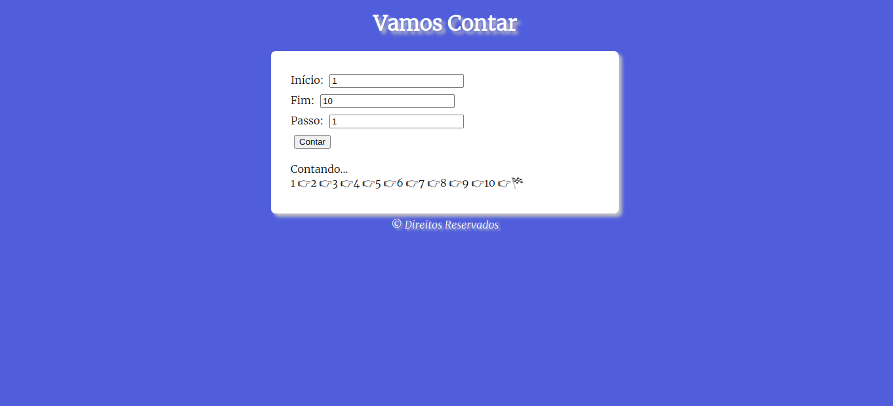
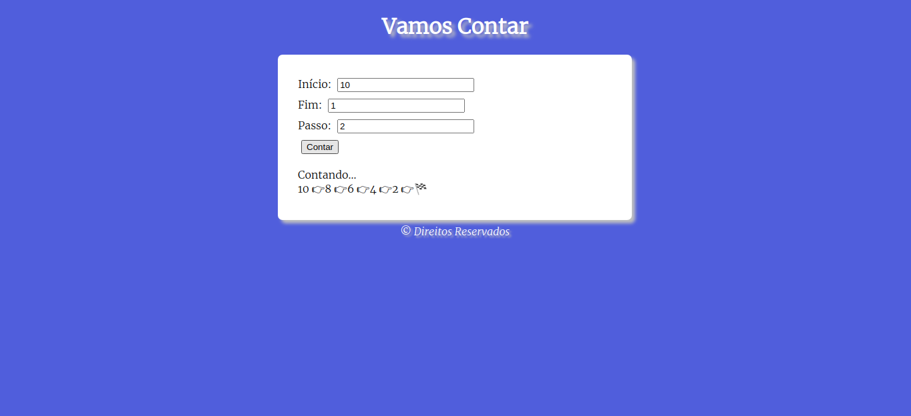

# Contagem-JS

Projeto feito através do curso de JS do Canal Curso em Vìdeo.

[Link Para Playlist](https://www.youtube.com/playlist?list=PLHz_AreHm4dlsK3Nr9GVvXCbpQyHQl1o1)

Contagem crescente e decrescente feita com o uso do 'for', usando o **passo** para determinar qual será a sequência da contagem. 

# Prints

**Crescente**

**Decrescente**

 
